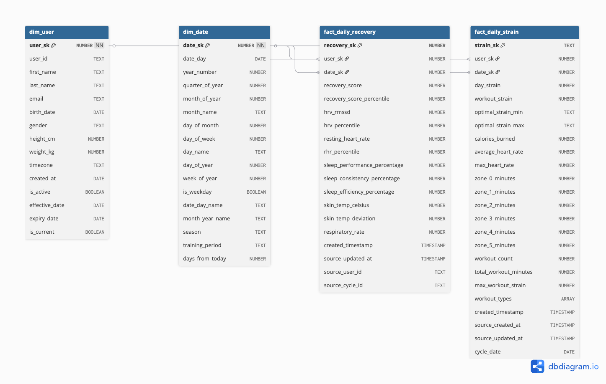

# Whoop Data Pipeline & Analytics Platform

A production-grade data pipeline that extracts, transforms, and visualizes personal health metrics from the Whoop API. This project demonstrates end-to-end data engineering skills including API integration, incremental ETL, dimensional modeling, and interactive dashboards.

## 🎯 Project Overview

This pipeline processes biometric data from Whoop wearables, transforming raw health metrics into actionable insights through a modern data stack. The system runs on Astronomer Cloud (Apache Airflow) with automated orchestration, error handling, and data quality checks.

### Key Features
- **Incremental Data Extraction**: OAuth2-authenticated API integration with automatic token refresh
- **Dimensional Modeling**: Star schema data warehouse with fact and dimension tables
- **Advanced Analytics**: 6 custom metrics including recovery momentum, strain efficiency, and autonomic balance
- **Interactive Dashboard**: Real-time visualizations with Streamlit
- **Production Orchestration**: Scheduled DAGs on Astronomer Cloud running every 3 hours

## 🏗️ Architecture

```
Whoop API → Airflow (Astronomer) → Snowflake → dbt → Streamlit Dashboard
```

### Technology Stack
- **Orchestration**: Apache Airflow (Astronomer Cloud)
- **Data Warehouse**: Snowflake
- **Transformation**: dbt (Data Build Tool) with Astronomer Cosmos
- **Visualization**: Streamlit
- **Languages**: Python, SQL
- **Authentication**: OAuth2 with automatic token refresh

## 📊 Data Model

The pipeline implements a **star schema** data warehouse optimized for analytical queries:

### Dimension Tables
- `dim_user` - User profiles with SCD Type 2 for historical tracking
- `dim_date` - Comprehensive date dimension with seasons and training periods

### Fact Tables
- `fact_daily_recovery` - Daily recovery metrics (HRV, RHR, sleep quality, respiratory rate)
- `fact_daily_strain` - Daily strain metrics (workouts, calories, heart rate zones)

### Metrics Tables
- `recovery_momentum` - Recovery score trends over 1, 3, 7, and 14-day periods
- `strain_recovery_efficiency` - How efficiently the body recovers from strain
- `training_readiness_gap` - Alignment between body readiness and training recommendations
- `recovery_volatility` - Consistency of recovery using 7-day and 30-day standard deviation
- `autonomic_balance` - HRV/RHR ratio analysis for nervous system balance
- `seasonal_adaptation` - Recovery patterns by season

### Entity Relationship Diagram



## 🚀 Pipeline Flow

### 1. Data Extraction
- Connects to Whoop API using OAuth2 authentication
- Implements incremental extraction (only new data since last run)
- Handles rate limiting with automatic backoff and retry logic
- Extracts from 5 endpoints: Cycle, Sleep, Recovery, Workout, User

### 2. Data Loading
- Direct loading to Snowflake `raw` schema tables
- State management tracks last processed timestamp per endpoint
- Adds extraction metadata (`_extracted_at`) to all records

### 3. Data Transformation (dbt)
- **Staging Layer**: Type casting, unit conversions (milliseconds → hours), basic cleansing
- **Intermediate Layer**: Advanced calculations and percentile analysis
- **Marts Layer**: Dimensional models with business logic and custom metrics

### 4. Orchestration (Airflow + Cosmos)
```
extract_data → dbt_staging → dbt_intermediate → dbt_marts → quality_checks
```

Each dbt model runs as a separate Airflow task with:
- Individual task-level logging for easy debugging
- Isolated failure handling (one model failure doesn't stop the pipeline)
- Task-level retries without rebuilding the entire pipeline
- Native OpenLineage for data lineage tracking

### 5. Visualization
- Interactive Streamlit dashboard with 6 analytical tabs
- Date range filtering (Last 7/30/90/365 days or All Time)
- Real-time metric calculations and trend visualizations

## 📈 Key Metrics Explained

**Recovery Momentum**: Tracks recovery score velocity over multiple time windows to identify improving or declining trends

**Strain Recovery Efficiency**: Calculates ratio of next-day recovery to strain load, showing how efficiently your body responds to training stress

**Training Readiness Gap**: Compares physiological readiness (based on HRV, RHR) against training recommendations to prevent overtraining

**Recovery Volatility**: Measures day-to-day consistency using rolling standard deviation - lower volatility indicates stable recovery patterns

**Autonomic Balance**: Analyzes HRV/RHR ratio to assess balance between sympathetic (stress) and parasympathetic (recovery) nervous systems

**Seasonal Adaptation**: Identifies seasonal patterns in recovery to adjust training based on environmental factors

## 🛠️ Setup & Deployment

### Prerequisites
- Python 3.9+
- Snowflake account
- Whoop Developer account (API credentials)
- Astronomer Cloud account (optional, for production deployment)

### Local Development
```bash
# Install dependencies
pip install -r requirements.txt

# Set up authentication (interactive OAuth flow)
python include/extract/utils/auth.py

# Configure environment variables
cp .env.example .env
# Edit .env with your credentials

# Run extraction locally
python include/extract/whoop_extractor.py

# Run dbt transformations
cd include/dbt
dbt deps
dbt run
dbt test
```

### Production Deployment (Astronomer)
```bash
# Deploy to Astronomer Cloud
astro deploy

# View deployment status
astro deploy list

# Access Airflow UI
# https://[your-deployment].astronomer.run/
```

### Dashboard
```bash
# Run Streamlit dashboard
docker-compose up streamlit

# Access at http://localhost:8501
```

## 📁 Project Structure

```
whoop_pipeline/
├── dags/                           # Airflow DAG definitions
│   ├── whoop_pipeline_cosmos_simple.py  # Production DAG (every 3 hours)
│   └── whoop_pipeline_cosmos_test.py    # Testing DAG (manual trigger)
├── include/
│   ├── extract/                    # Python extraction modules
│   │   ├── whoop_extractor.py     # Main extraction script
│   │   └── utils/
│   │       ├── auth.py            # OAuth2 authentication
│   │       ├── snowflake_client.py # Snowflake integration
│   │       └── state_manager.py    # Pipeline state tracking
│   └── dbt/                        # dbt transformations
│       ├── models/
│       │   ├── staging/           # Staging models (type casting, conversions)
│       │   ├── intermediate/      # Advanced calculations
│       │   └── marts/             # Dimensional models & metrics
│       │       ├── dimensions/    # Dimension tables
│       │       ├── facts/         # Fact tables
│       │       └── metrics/       # Custom metrics
│       ├── macros/                # Reusable SQL macros
│       ├── dbt_project.yml        # dbt configuration
│       └── profiles.yml           # Snowflake connection
├── streamlit_app/                  # Interactive dashboard
│   └── streamlit_dashboard.py     # Main dashboard application
├── docs/                           # Documentation
│   └── whoop_marts_erd.dbml       # Entity Relationship Diagram
├── .env                            # Environment variables (local)
├── .env.astronomer                 # Astronomer-specific env vars
├── requirements.txt                # Python dependencies
└── README.md                       # This file
```

## 🔄 Data Pipeline Schedule

**Production DAG**: `whoop_pipeline_cosmos_simple`
- **Schedule**: Every 3 hours
- **Expected records per run**: 0-25 (incremental extraction)
- **Status**: ✅ Fully operational

## 🧪 Data Quality & Testing

### dbt Tests
- Uniqueness and not-null constraints for primary keys
- Value range validations (e.g., recovery_score 0-100)
- Accepted values for categorical fields
- Data type consistency checks
- Referential integrity between fact and dimension tables

### Pipeline Monitoring
- Automatic warehouse resume on query execution
- Comprehensive error logging per dbt model
- State management prevents duplicate processing
- Rate limit handling with exponential backoff

## 📊 Dashboard Features

- **6 Interactive Tabs**: One for each custom metric
- **Date Range Filtering**: Dynamically filter all visualizations
- **Real-time Calculations**: Metrics update based on selected date range
- **Multi-chart Visualizations**: Line charts, bar charts, scatter plots
- **Category Analysis**: Distribution charts for categorical metrics

## 🎓 Skills Demonstrated

### Data Engineering
- API integration with OAuth2 authentication
- Incremental ETL with state management
- Dimensional modeling (star schema)
- Data warehouse design (Snowflake)
- SQL optimization and window functions

### Data Orchestration
- Apache Airflow DAG development
- Astronomer Cosmos integration for dbt
- Task dependency management
- Error handling and retry logic

### Analytics Engineering
- dbt model development (staging → intermediate → marts)
- Macro development for reusable transformations
- Data quality testing
- Documentation and lineage

### Visualization
- Streamlit dashboard development
- Interactive data visualization with Plotly
- Dynamic filtering and aggregation

## 🔐 Security & Best Practices

- OAuth2 token refresh handled via Airflow Variables
- Snowflake credentials stored securely in environment variables
- Private key authentication for Snowflake connections
- State management prevents duplicate data processing
- Comprehensive error handling and logging

## 📝 Lessons Learned

### Challenges Overcome
1. **API Rate Limiting**: Implemented exponential backoff with 60-second delays for 429 errors
2. **Token Refresh**: Migrated from environment variables to Airflow Variables for reliable OAuth refresh
3. **dbt Version Compatibility**: Adapted model selectors for dbt 1.10.8 compatibility in Astronomer
4. **Cosmos Integration**: Configured proper dbt task execution with individual model logging
5. **Date Filtering**: Fixed subquery issues with direct `DATEADD()` function for reliable filtering

### Best Practices Applied
- Incremental extraction to minimize API calls and processing time
- Star schema design for optimal query performance
- Separate staging, intermediate, and marts layers for maintainability
- Task-level isolation in Airflow for easier debugging
- Comprehensive documentation for knowledge transfer

## 🚦 Current Status

**Pipeline Status**: ✅ Production-ready and operational
- Deployed on Astronomer Cloud
- Running every 3 hours
- All data quality tests passing
- Dashboard accessible via Docker

## 📧 Contact

For questions or collaboration opportunities, please reach out via [LinkedIn](https://linkedin.com/in/yourprofile) or [email](mailto:your.email@example.com).

---

*Built with Python, Airflow, dbt, Snowflake, and Streamlit*
