# Whoop Marts Schema - Entity Relationship Diagram

## Schema Overview

```mermaid
erDiagram
    DIM_USER ||--o{ FACT_DAILY_RECOVERY : "has"
    DIM_USER ||--o{ FACT_DAILY_STRAIN : "has"
    DIM_DATE ||--o{ FACT_DAILY_RECOVERY : "has"
    DIM_DATE ||--o{ FACT_DAILY_STRAIN : "has"

    DIM_USER ||--o{ RECOVERY_MOMENTUM : "has"
    DIM_USER ||--o{ RECOVERY_VOLATILITY : "has"
    DIM_USER ||--o{ AUTONOMIC_BALANCE : "has"
    DIM_USER ||--o{ STRAIN_RECOVERY_EFFICIENCY : "has"
    DIM_USER ||--o{ TRAINING_READINESS_GAP : "has"
    DIM_USER ||--o{ SEASONAL_ADAPTATION : "has"
    DIM_USER ||--o{ STRAIN_SUSTAINABILITY : "has"

    DIM_DATE ||--o{ RECOVERY_MOMENTUM : "has"
    DIM_DATE ||--o{ RECOVERY_VOLATILITY : "has"
    DIM_DATE ||--o{ AUTONOMIC_BALANCE : "has"
    DIM_DATE ||--o{ STRAIN_RECOVERY_EFFICIENCY : "has"
    DIM_DATE ||--o{ TRAINING_READINESS_GAP : "has"
    DIM_DATE ||--o{ SEASONAL_ADAPTATION : "has"
    DIM_DATE ||--o{ STRAIN_SUSTAINABILITY : "has"

    DIM_USER {
        NUMBER user_sk PK
        TEXT user_id
        TEXT first_name
        TEXT last_name
        TEXT email
        DATE birth_date
        TEXT gender
        NUMBER height_cm
        NUMBER weight_kg
        TEXT timezone
        DATE created_at
        BOOLEAN is_active
        DATE effective_date
        DATE expiry_date
        BOOLEAN is_current
    }

    DIM_DATE {
        NUMBER date_sk PK
        DATE date_day
        NUMBER year_number
        NUMBER quarter_of_year
        NUMBER month_of_year
        TEXT month_name
        NUMBER day_of_month
        NUMBER day_of_week
        TEXT day_name
        NUMBER day_of_year
        NUMBER week_of_year
        BOOLEAN is_weekday
        TEXT date_day_name
        TEXT month_year_name
        TEXT season
        TEXT training_period
        NUMBER days_from_today
    }

    FACT_DAILY_RECOVERY {
        NUMBER recovery_sk PK
        NUMBER user_sk FK
        NUMBER date_sk FK
        NUMBER recovery_score
        NUMBER recovery_score_percentile
        NUMBER hrv_rmssd
        NUMBER hrv_percentile
        NUMBER resting_heart_rate
        NUMBER rhr_percentile
        NUMBER sleep_performance_percentage
        NUMBER sleep_consistency_percentage
        NUMBER sleep_efficiency_percentage
        NUMBER skin_temp_celsius
        NUMBER skin_temp_deviation
        NUMBER respiratory_rate
        TIMESTAMP created_timestamp
        TIMESTAMP source_updated_at
        TEXT source_user_id
        TEXT source_cycle_id
    }

    FACT_DAILY_STRAIN {
        TEXT strain_sk PK
        NUMBER user_sk FK
        NUMBER date_sk FK
        NUMBER day_strain
        NUMBER workout_strain
        TEXT optimal_strain_min
        TEXT optimal_strain_max
        NUMBER calories_burned
        NUMBER average_heart_rate
        NUMBER max_heart_rate
        NUMBER zone_0_minutes
        NUMBER zone_1_minutes
        NUMBER zone_2_minutes
        NUMBER zone_3_minutes
        NUMBER zone_4_minutes
        NUMBER zone_5_minutes
        NUMBER workout_count
        NUMBER total_workout_minutes
        NUMBER max_workout_strain
        ARRAY workout_types
        TIMESTAMP created_timestamp
        TIMESTAMP source_created_at
        TIMESTAMP source_updated_at
        DATE cycle_date
    }

    RECOVERY_MOMENTUM {
        NUMBER user_sk FK
        NUMBER date_sk FK
        NUMBER recovery_score
        NUMBER day_1_change
        NUMBER day_3_change
        NUMBER day_7_change
        NUMBER day_14_change
        NUMBER raw_momentum
        NUMBER recovery_momentum_score
        TEXT momentum_category
        TIMESTAMP calculated_at
    }

    RECOVERY_VOLATILITY {
        NUMBER user_sk FK
        NUMBER date_sk FK
        NUMBER recovery_score
        FLOAT volatility_7d
        FLOAT volatility_30d
        FLOAT volatility_coefficient
        FLOAT volatility_trend
        TEXT volatility_category
        TIMESTAMP calculated_at
    }

    AUTONOMIC_BALANCE {
        NUMBER user_sk FK
        NUMBER date_sk FK
        NUMBER recovery_score
        NUMBER hrv_rmssd
        NUMBER hrv_percentile
        NUMBER resting_heart_rate
        NUMBER rhr_percentile
        NUMBER respiratory_rate
        FLOAT respiratory_percentile
        FLOAT autonomic_balance_score
        NUMBER hrv_rhr_ratio
        NUMBER hrv_rhr_ratio_7d_avg
        TEXT balance_category
        TIMESTAMP calculated_at
    }

    STRAIN_RECOVERY_EFFICIENCY {
        NUMBER user_sk FK
        NUMBER date_sk FK
        NUMBER day_strain
        NUMBER recovery_score
        NUMBER next_day_recovery
        NUMBER baseline_recovery
        NUMBER recovery_efficiency_ratio
        NUMBER efficiency_30day_avg
        TEXT efficiency_category
        TIMESTAMP calculated_at
    }

    TRAINING_READINESS_GAP {
        NUMBER user_sk FK
        NUMBER date_sk FK
        NUMBER recovery_score
        NUMBER body_readiness
        FLOAT optimal_strain_target
        NUMBER training_recommendation_score
        NUMBER readiness_motivation_gap
        TEXT gap_category
        BOOLEAN overtraining_risk_flag
        TIMESTAMP calculated_at
    }

    SEASONAL_ADAPTATION {
        NUMBER user_sk FK
        NUMBER date_sk FK
        TEXT season
        NUMBER recovery_score
        NUMBER seasonal_recovery_baseline
        NUMBER recovery_deviation
        NUMBER seasonal_adaptation_index
        TEXT adaptation_category
        TIMESTAMP calculated_at
    }

    STRAIN_SUSTAINABILITY {
        NUMBER user_sk FK
        NUMBER date_sk FK
        NUMBER day_strain
        TEXT optimal_strain_min
        TEXT optimal_strain_max
        TEXT strain_category
        NUMBER strain_deviation
        FLOAT sustainability_score_30d
        TEXT sustainability_category
        TIMESTAMP calculated_at
    }
```

## Table Categories

### Dimension Tables (2)
- **DIM_USER**: User profile information with SCD Type 2 (slowly changing dimension)
- **DIM_DATE**: Date dimension with calendar attributes and training periods

### Fact Tables (2)
- **FACT_DAILY_RECOVERY**: Daily recovery metrics including HRV, RHR, sleep, and skin temperature
- **FACT_DAILY_STRAIN**: Daily strain metrics including workout data and heart rate zones

### Metrics Tables (7)
- **RECOVERY_MOMENTUM**: Tracks recovery score changes over 1, 3, 7, and 14 day periods
- **RECOVERY_VOLATILITY**: Measures consistency of recovery using standard deviation over 7 and 30 days
- **AUTONOMIC_BALANCE**: Analyzes HRV/RHR ratio to assess autonomic nervous system balance
- **STRAIN_RECOVERY_EFFICIENCY**: Calculates how efficiently the body recovers from strain
- **TRAINING_READINESS_GAP**: Compares body readiness vs training recommendations
- **SEASONAL_ADAPTATION**: Analyzes recovery patterns by season
- **STRAIN_SUSTAINABILITY**: Evaluates if training strain is within optimal ranges (currently empty)

## Relationships

### Primary Relationships
- All fact and metric tables link to `DIM_USER` via `user_sk`
- All fact and metric tables link to `DIM_DATE` via `date_sk`

### Composite Keys
Most metric tables use composite keys of (`user_sk`, `date_sk`) for uniqueness

## Key Insights
1. **Star Schema**: Classic star schema with dimension tables at center
2. **Grain**: Daily grain for all facts and metrics (one row per user per day)
3. **SCD Type 2**: DIM_USER uses effective_date/expiry_date/is_current for history tracking
4. **Calculated Metrics**: All metrics tables derive from the two core fact tables
5. **Data Lineage**: FACT tables → METRICS tables → Dashboard visualizations
